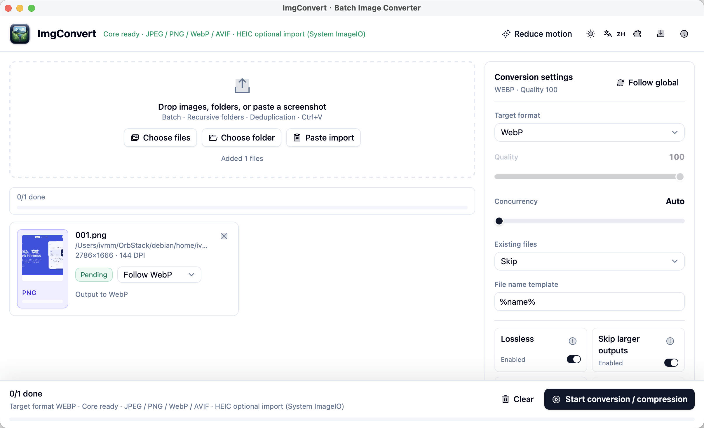
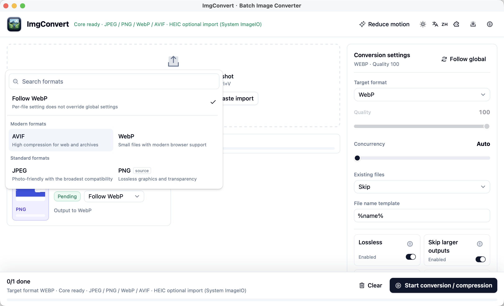
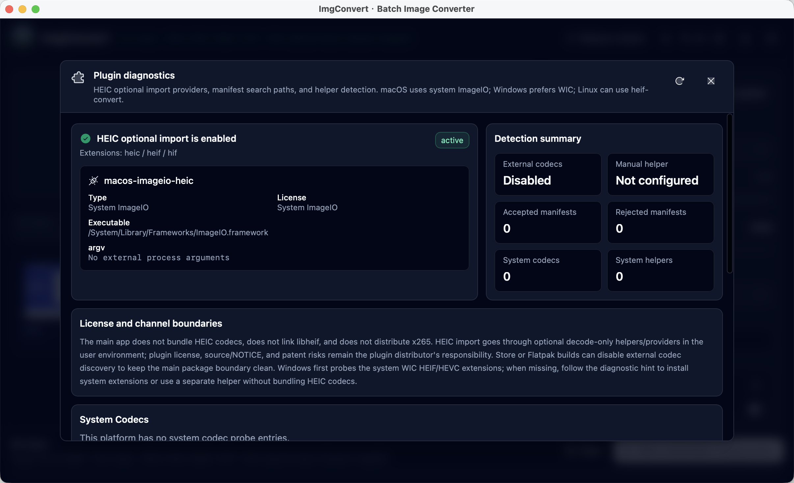

<div align="center">
  
  <h1>ImgConvert</h1>
  <p><strong>本地优先的跨平台图片批量转换与压缩工具</strong></p>
  <p>拖拽即转 · 批量处理 · 元数据保真 · 默认不上传图片</p>
  <p><a href="README.md">English</a> · <strong>简体中文</strong></p>
  <p>
    <a href="https://github.com/web-casa/ImgConvert/releases/latest">
      
    </a>
    <a href="https://github.com/web-casa/ImgConvert/actions/workflows/ci.yml">
      
    </a>
    <a href="LICENSE">
      
    </a>
    <a href="https://tauri.app">
      
    </a>
    <a href="https://svelte.dev">
      
    </a>
  </p>
  <p>
    <a href="https://github.com/web-casa/ImgConvert/releases/latest">
      <strong>下载最新版本</strong>
    </a>
    · <a href="docs/ROADMAP.md">路线图</a>
    · <a href="docs/ENGINE.md">技术架构</a>
    · <a href="PRIVACY.md">隐私政策</a>
  </p>
</div>

<p align="center">
  <a href="docs/assets/screenshots/main-workspace.png">
    
  </a>
</p>
<p align="center">
  <sub>批量导入、逐文件格式覆盖、全局压缩设置与转换进度集中在一个工作区。</sub>
</p>

> [!NOTE]
> 最新 GitHub Release 为 **v0.2.11**，提供 Linux x86_64 AppImage 与已签名的
> updater 元数据。Snap Store 的 stable 渠道独立提供 Linux amd64 与 arm64 版本；
> macOS 和 Windows 原生双架构候选包会先在 Actions 验证，再进入后续 GitHub Release。

## 下载

| 平台                | 安装包                                        | 状态                                  |
| ------------------- | --------------------------------------------- | ------------------------------------- |
| macOS arm64 / x64   | DMG                                           | 双架构 CI 验证中                      |
| Windows x64 / arm64 | NSIS EXE、中文/英文 MSI                       | 双架构 CI 验证中                      |
| Linux amd64 / arm64 | [Snap Store](https://snapcraft.io/imgconvert) | stable 渠道已发布                     |
| Linux x86_64        | [AppImage][latest-release]                    | 已发布，含 updater 元数据             |
| Microsoft Store     | MSIX                                          | x64 已进 Partner Center，arm64 待提交 |
| Mac App Store       | MAS 包                                        | 等待验证与审核                        |

> [!WARNING]
> Actions 生成的 Windows EXE/MSI 候选包当前没有 Authenticode 签名，可能触发
> Microsoft Defender SmartScreen。在 Release 提供匹配的 `SHA256SUMS-windows.txt`
> 之前，不应把这些候选包视为正式发布安装包。

## 界面预览

<table>
  <tr>
    <td width="50%" valign="top">
      <a href="docs/assets/screenshots/format-picker.png">
        
      </a>
    </td>
    <td width="50%" valign="top">
      <a href="docs/assets/screenshots/plugin-diagnostics.png">
        
      </a>
    </td>
  </tr>
  <tr>
    <td align="center"><sub>逐文件覆盖输出格式，不影响其他队列项目。</sub></td>
    <td align="center"><sub>透明展示 HEIC provider、系统能力与许可边界。</sub></td>
  </tr>
</table>

## 核心能力

| 能力       | 说明                                                                   |
| ---------- | ---------------------------------------------------------------------- |
| 格式转换   | 进程内支持 AVIF、WebP、JPEG、PNG；支持 AVIF 真无损                     |
| 批量工作流 | 文件、目录、递归与剪贴板导入；去重、异步缩略图、进度和取消             |
| 性能控制   | Rust 端批量转换、并发控制、内存预算降并发与 Channel 进度上报           |
| 压缩策略   | `skip-if-larger`、多候选取最小、自动质量与代际损失防护                 |
| 图像保真   | EXIF orientation 真旋正，保留或剥离 ICC / EXIF / XMP / IPTC            |
| 色彩管理   | Display P3 ICC 测试、显式转 sRGB 与色彩管线 v2                         |
| HEIC 导入  | macOS ImageIO、Windows WIC、Linux helper / Flatpak extension；只读导入 |
| 本地隐私   | 图片处理默认在本机完成，不需要账号，不上传原始图片                     |
| 发布工程   | Tauri updater、跨平台安装包、许可 / fuzz / benchmark / CI 护栏         |

## 发布与项目状态

- ✅ **GitHub Release v0.2.11**：提供 Linux x86_64 AppImage 与已签名 updater
  元数据。Snap Store stable 独立提供 amd64 与 arm64。
- 🚧 **桌面直发安装包**：macOS 和 Windows 的 arm64/x64 原生工作流已配置；
  成功通过 CI、签名与公证后再发布到 Release。
- ✅ **macOS 直发**：Developer ID Application 签名、公证、staple 与 Gatekeeper
  验证已通过。
- ✅ **核心能力**：P0–P3 的 UI、Rust 引擎、批处理、压缩、metadata、色彩、
  fuzz 与跨平台打包入口已落地。
- 🚧 **真实发布验收**：MAS 已完成构建、沙盒与签名检查，仍需 App Store Connect
  建档、上传和 App Review；Microsoft Store 提交由授权账户负责人完成。
- 🚧 **外部验收**：Flathub 审核、Windows 直发签名、真实图片 corpus 长跑 fuzz
  与 Windows benchmark 数据继续推进。

完整计划、验收证据和后续事项见 [docs/ROADMAP.md](docs/ROADMAP.md)。

## 架构与技术栈

| 层级     | 技术与边界                                                     |
| -------- | -------------------------------------------------------------- |
| 桌面壳   | Tauri 2                                                        |
| 前端     | Svelte 5 runes、shadcn-svelte、Tailwind CSS v4、Phosphor Icons |
| 图像核心 | Rust、`mozjpeg`、`oxipng`、`webp`、`libavif-sys`、`image`      |
| HEIC     | 主程序不内置 HEIC codec；按平台使用系统 provider 或可选 helper |
| 工具链   | pnpm、Node LTS、Rust toolchain、CMake、Meson、Ninja、NASM      |

图像引擎采用“进程内宽松许可 Rust 编解码器 + 平台系统 HEIC”的混合架构。
主程序不分发 x265，也不输出 HEIC。具体设计与许可边界见
[docs/ENGINE.md](docs/ENGINE.md) 和 [docs/LEGAL.md](docs/LEGAL.md)。

## 快速开始

需要 [Rust](https://rustup.rs/)、Node LTS、[pnpm](https://pnpm.io/) 与当前平台的
Tauri 系统依赖。原生图像依赖还需要 CMake、Meson、Ninja 和 NASM。

```bash
pnpm install
pnpm run tauri dev
```

常用检查与构建命令：

```bash
pnpm run check
pnpm run build
pnpm run tauri build
pnpm run docs:web:dev

pnpm run release:readiness
pnpm run release:readiness:github:ready
pnpm run release:readiness:all
pnpm run release:platform:check
```

> [!TIP]
> Linux 若提示缺少 `dbus-1.pc`，请安装 `libdbus-1-dev` / `dbus-devel` 与
> `pkg-config`。完整平台工具链说明见 [docs/ENGINE.md](docs/ENGINE.md)。

## 文档

- [ROADMAP](docs/ROADMAP.md)：路线图、版本状态、开发优先级与发布 readiness 报告
- [ENGINE](docs/ENGINE.md)：图像核心、系统 HEIC、工具链与打包签名
- [RELEASE_QA](docs/RELEASE_QA.md)：跨平台、安装包、更新与商店发布的必做验收记录
- [LEGAL](docs/LEGAL.md)：Apache-2.0、依赖许可红线、HEVC 专利与分发边界
- [REFERENCES](docs/REFERENCES.md)：参考项目调研与可复用设计
- [PRIVACY](PRIVACY.md) / [English](PRIVACY.en.md)：中英文隐私政策
- [CONTRIBUTING](CONTRIBUTING.md)：贡献流程、DCO 与开发约定

## 许可证

ImgConvert 以 [Apache-2.0](LICENSE) 发布，可商用并允许应用商店分发。依赖许可
红线、第三方组件清单与 HEVC 风险说明见 [docs/LEGAL.md](docs/LEGAL.md)。

[latest-release]: https://github.com/web-casa/ImgConvert/releases/latest
